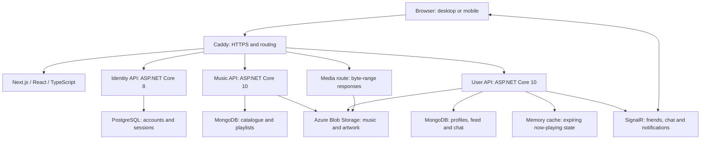

<h1 align="center">Spotibuds</h1>

Discover music, make it yours and share it with friends.

Albums and playback · Favorites and playlists · Listening feed · Friends and live chat

## Watch the app in action

Play a recording below and unmute to hear the music. All six demos are visible on this page.

### Overview · 1:16

Listen, collect, react and chat across desktop and mobile in 76 seconds.

https://github.com/user-attachments/assets/e77e37b6-90f7-4a4f-bab4-9d27be7a8e78

### Discover and listen · 1:54

Search music and people, explore artists and albums, and control playback and the queue on desktop and mobile.

https://github.com/user-attachments/assets/46847f3f-ade7-4c8e-ab09-19c5ffa80536

### Favorites and playlists · 0:57

Save favorites, create a playlist, edit its cover and visibility, reorder tracks and check persistence after reload.

https://github.com/user-attachments/assets/a4ca6f5b-31b1-4037-a924-0c9cb51af75e

### Feed and listening profiles · 1:42

Play from the listening feed, react to activity, see who reacted and explore listening profiles and shared tastes.

https://github.com/user-attachments/assets/71aa5a37-a19e-4dab-b31d-fbe0c263c614

### Friends, chat and notifications · 1:24

Send and accept friend requests, exchange messages between desktop and mobile, and check receipts, saved history and notifications.

https://github.com/user-attachments/assets/2e04e1f5-ab94-49f5-847f-b6135ca6d42f

### Accounts and administration · 1:46

Register, edit profiles, avatars and privacy, and preview administration screens. Catalogue writes and role changes are not saved.

https://github.com/user-attachments/assets/ddf68cbf-700a-4269-8efe-8535aeca6b93

## The implementation, briefly

Next.js, React and TypeScript on the frontend. Three ASP.NET Core services separate identity, music and social activity. PostgreSQL stores accounts; MongoDB stores catalogue and social data. SignalR delivers live chat and notifications. Docker services run behind Caddy, with media in Azure Blob Storage.

- One player keeps its state across views; byte-range media delivery supports progressive playback and seeking.
- Messages persist on the server, with delivery acknowledgements and read receipts between independent sessions.
- Access tokens stay in memory; refresh credentials use HttpOnly cookies.

## Verification and setup

The recorded source passed **234 frontend tests**, TypeScript checks, ESLint and a production build, followed by **31 live checks**. [Verification record](https://github.com/Spotibuds/Frontend/blob/main/docs/portfolio/showcase-verification.json).

Actual browser recordings with existing catalogue music and synthetic participants. Mobile footage shows the responsive web app. Captions are visible in the footage and listening scenes include captured music. Administration writes are previews; production recovery email needs a relay. Device and load testing remain scoped.

[Run locally](https://github.com/Spotibuds/Frontend/tree/main/demo) · [Architecture and source](https://github.com/Spotibuds/Frontend/tree/main/docs/portfolio) · [Recordings, captions and chapters](https://github.com/Spotibuds/Frontend/releases/tag/demo-suite-2026-10-05)

## Architecture

The deployed environment uses Docker on an Azure VM. This is a single-instance demo deployment. Now-playing state uses a bounded in-process cache. Redis is provisioned in the local environment but is not required for media delivery or configured as a SignalR backplane. The separate service repositories are [Identity](https://github.com/Spotibuds/Identity), [Music](https://github.com/Spotibuds/Music) and [User](https://github.com/Spotibuds/User).

## Engineering decisions

- **Session handling:** access tokens remain in memory; refresh credentials use HttpOnly cookies. A shared refresh coordinator and two-phase renewal handle expiry and interrupted navigation. Session changes stop playback and obsolete requests.
- **Reusable listening controls:** catalogue rows, feed cards and the expanded player use the same audio state. Album and performer links are separate controls, so navigation and playback have distinct behavior. Media byte ranges allow progressive playback and seeking.
- **Responsive loading:** profile and artist headers appear after their primary request; independent collections load separately. Direct profile links avoid an intermediate redirect. Route instances and abort/version guards prevent late responses from replacing a newly opened page.
- **Data integrity:** playlist membership and social operations use server authorization and transactional updates. Favorites converge across the library and player. Failed writes retain input with actionable feedback.
- **Realtime communication:** chat sends use a stable draft ID and persisted acknowledgement. Independent sessions demonstrate message delivery and history after reload. Backend commands own authorization and persistence for hub and REST entry points.
- **Responsive interaction:** desktop and mobile share components and data. The chat layout reserves the measured player height, keeping the mobile composer accessible while music plays.
- **Demo preparation:** small, journaled activity additions reuse existing catalogue IDs. Pre-write backups and preservation checks protect existing data; no reset was used for this recording.

## Verification and limits

The frontend readiness pass completed **234 tests across 27 files**, TypeScript checking, ESLint with zero warnings and a production build. The release passed **31 live deployment checks**. The selected recorded scenes completed without browser errors. These results are a scoped verification record, not an exhaustive accessibility, device, concurrency or load certification.

[Product readiness evidence](../product-readiness-verification.json) lists the reviewed areas, fixes and test methods. [Showcase verification](showcase-verification.json) records the deployed source revisions, recording method and final encoding checks. The [demo release](https://github.com/Spotibuds/Frontend/releases/tag/demo-suite-2026-10-05) includes captions and SHA-256 checksums.

Own-profile navigation samples decreased from about 1.94 seconds before the change to 0.45–0.94 seconds afterward. Those few samples include browser rendering and variable network activity; they are not a performance SLA. Artist timings remained variable, so the improvement claimed there is earlier primary content and independent section loading. The live playback check observed progress and a successful HTTP 206 response without media interception.

Remaining operational work includes configuring the production email relay for password recovery, upgrading Identity's .NET 8 runtime, and testing load and multiple replicas before scaling. Three artists retain initial-based artwork fallbacks where a verified picture was unavailable. The dependency audit exception and expiry are documented in the [frontend README](../../README.md#dependency-exception-and-evidence).

## Run locally

Follow the [isolated demo guide](../../demo/README.md) for the four sibling repositories, generated local credentials, Docker dependencies and verification commands. That reproducible setup uses generated tone fixtures and fresh local data. It does not depend on the production music files or cloud credentials.
