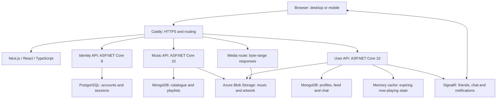

# Spotibuds project showcase

Spotibuds combines music discovery, personal collections and conversations with friends in a responsive web app.

**Next.js · React · TypeScript · ASP.NET Core · PostgreSQL · MongoDB · SignalR**

## The app in 76 seconds

Listen to an album, react to a friend's activity, build a collection and send a message from desktop to mobile. Play the recording below with sound.

https://github.com/user-attachments/assets/e77e37b6-90f7-4a4f-bab4-9d27be7a8e78

## Behind the experience

- **One player across the app.** Catalogue rows, feed posts and the expanded player share playback state. Album and artist navigation keeps the music playing; byte-range media delivery supports progressive playback and seeking.
- **Persistent social interaction.** SignalR delivers chat and notifications between independent sessions. Messages have persisted acknowledgements and read receipts; the recordings check history after reloading.
- **Separate services, shared contracts.** Identity handles accounts and sessions in PostgreSQL. Music owns the catalogue and playlists in MongoDB. User handles profiles, listening activity and friendships, also in MongoDB.
- **Sessions and loading states.** Access tokens stay in memory and refresh credentials use HttpOnly cookies. Independent page sections load separately, with request guards to prevent stale responses from replacing the current view.

## Explore the workflows

### Discover and listen · 1:54

Search songs, albums, artists and people. Open an album, play tracks, manage the queue and move through the app on mobile.

https://github.com/user-attachments/assets/46847f3f-ade7-4c8e-ab09-19c5ffa80536

### Favorites and playlists · 0:57

Save a song, create a playlist, add songs and albums, edit its cover and visibility, reorder tracks and check that changes survive a reload.

https://github.com/user-attachments/assets/a4ca6f5b-31b1-4037-a924-0c9cb51af75e

### Feed and listening profiles · 1:42

Play a song from a friend's listening activity, add or remove a reaction, see who reacted and follow the post into a listening profile. Weekly tracks, top artists and shared tastes appear in the same feed.

https://github.com/user-attachments/assets/71aa5a37-a19e-4dab-b31d-fbe0c263c614

### Friends, chat and notifications · 1:24

Send and respond to friend requests, then exchange messages between independent desktop and mobile sessions. Delivery, read receipts, saved history and inbox actions are shown in context.

https://github.com/user-attachments/assets/2e04e1f5-ab94-49f5-847f-b6135ca6d42f

### Accounts and administration · 1:46

Register, sign in, update a profile and avatar, change privacy settings and explore the administration screens. Catalogue writes and role changes are previewed without saving; the recording also shows unavailable email recovery.

https://github.com/user-attachments/assets/ddf68cbf-700a-4269-8efe-8535aeca6b93

## Source and local setup

| Repository                                        | Responsibility                                                                        |
| ------------------------------------------------- | ------------------------------------------------------------------------------------- |
| [Frontend](https://github.com/Spotibuds/Frontend) | Next.js, React and TypeScript; shared player, navigation and session coordination     |
| [Identity](https://github.com/Spotibuds/Identity) | ASP.NET Core accounts, roles and refresh sessions; PostgreSQL                         |
| [Music](https://github.com/Spotibuds/Music)       | ASP.NET Core catalogue, playlists and media access; MongoDB and Azure Blob Storage    |
| [User](https://github.com/Spotibuds/User)         | ASP.NET Core profiles, feed, friendships, notifications and chat; MongoDB and SignalR |

The recorded deployment ran Docker services behind Caddy HTTPS on an Azure VM. The [local demo guide](https://github.com/Spotibuds/Frontend/tree/main/demo) starts the same service layout with generated credentials and audio fixtures; cloud credentials and production song downloads are not required. [Architecture and engineering details](https://github.com/Spotibuds/Frontend/tree/main/docs/portfolio).

## Verification and scope

The recorded source passed **234 frontend tests**, TypeScript checks, ESLint and a production build. **31 live checks** were repeated after recording. [Verification record](https://github.com/Spotibuds/Frontend/blob/main/docs/portfolio/showcase-verification.json).

The videos show actual browser interactions with existing catalogue music and synthetic participants. Listening scenes contain captured playback audio, and captions are visible in the footage. Mobile footage shows the responsive web app. Administration writes are previews; production recovery email still needs a relay. Device and load testing remain scoped rather than exhaustive.

[Recording files, captions and chapters](https://github.com/Spotibuds/Frontend/releases/tag/demo-suite-2026-10-05) · [Recorded feature index](https://github.com/Spotibuds/Frontend/blob/main/docs/demo-coverage.json).

## Architecture

The deployed environment uses Docker on an Azure VM. This is a single-instance demo deployment. Now-playing state uses a bounded in-process cache. Redis is provisioned in the local environment but is not required for media delivery or configured as a SignalR backplane. The separate service repositories are [Identity](https://github.com/Spotibuds/Identity), [Music](https://github.com/Spotibuds/Music) and [User](https://github.com/Spotibuds/User).

## Engineering decisions

- **Session handling:** access tokens remain in memory; refresh credentials use HttpOnly cookies. A shared refresh coordinator and two-phase renewal handle expiry and interrupted navigation. Session changes stop playback and obsolete requests.
- **Reusable listening controls:** catalogue rows, feed cards and the expanded player use the same audio state. Album and performer links are separate controls, so navigation and playback have distinct behavior. Media byte ranges allow progressive playback and seeking.
- **Responsive loading:** profile and artist headers appear after their primary request; independent collections load separately. Direct profile links avoid an intermediate redirect. Route instances and abort/version guards prevent late responses from replacing a newly opened page.
- **Data integrity:** playlist membership and social operations use server authorization and transactional updates. Favorites converge across the library and player. Failed writes retain input with actionable feedback.
- **Realtime communication:** chat sends use a stable draft ID and persisted acknowledgement. Independent sessions demonstrate message delivery and history after reload. Backend commands own authorization and persistence for hub and REST entry points.
- **Responsive interaction:** desktop and mobile share components and data. The chat layout reserves the measured player height, keeping the mobile composer accessible while music plays.
- **Demo preparation:** small, journaled activity additions reuse existing catalogue IDs. Pre-write backups and preservation checks protect existing data; no reset was used for this recording.

## Verification and limits

The frontend readiness pass completed **234 tests across 27 files**, TypeScript checking, ESLint with zero warnings and a production build. The release passed **31 live deployment checks**. The selected recorded scenes completed without browser errors. These results are a scoped verification record, not an exhaustive accessibility, device, concurrency or load certification.

[Product readiness evidence](../product-readiness-verification.json) lists the reviewed areas, fixes and test methods. [Showcase verification](showcase-verification.json) records the deployed source revisions, recording method and final encoding checks. The [demo release](https://github.com/Spotibuds/Frontend/releases/tag/demo-suite-2026-10-05) includes captions and SHA-256 checksums.

Own-profile navigation samples decreased from about 1.94 seconds before the change to 0.45–0.94 seconds afterward. Those few samples include browser rendering and variable network activity; they are not a performance SLA. Artist timings remained variable, so the improvement claimed there is earlier primary content and independent section loading. The live playback check observed progress and a successful HTTP 206 response without media interception.

Remaining operational work includes configuring the production email relay for password recovery, upgrading Identity's .NET 8 runtime, and testing load and multiple replicas before scaling. Three artists retain initial-based artwork fallbacks where a verified picture was unavailable. The dependency audit exception and expiry are documented in the [frontend README](../../README.md#dependency-exception-and-evidence).

## Run locally

Follow the [isolated demo guide](../../demo/README.md) for the four sibling repositories, generated local credentials, Docker dependencies and verification commands. That reproducible setup uses generated tone fixtures and fresh local data. It does not depend on the production music files or cloud credentials.
