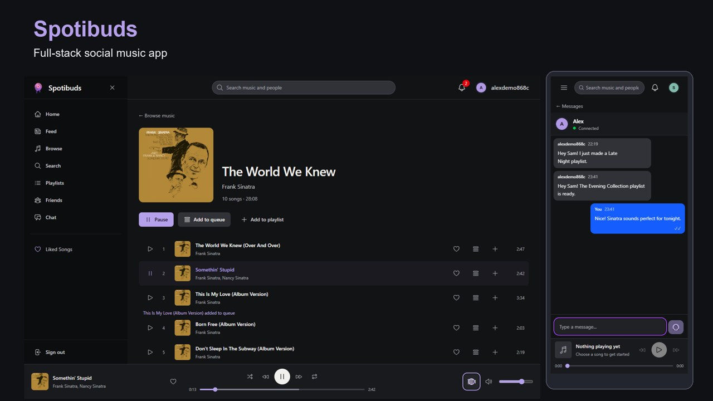
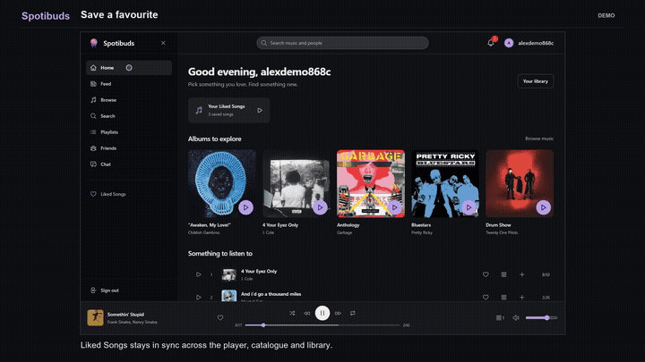
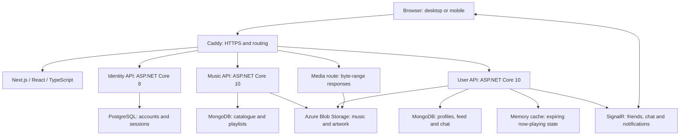

# Spotibuds project showcase

Spotibuds brings music listening and social interaction into one app. The recordings demonstrate user workflows, while the source and verification records explain how those workflows are implemented.

## Watch

- [Short overview, about 1 minute 45 seconds](https://github.com/Spotibuds/Frontend/releases/download/portfolio-demo-2026-10-04/Spotibuds-Overview.mp4)
- [Full walkthrough, about 2 minutes 50 seconds](https://github.com/Spotibuds/Frontend/releases/download/portfolio-demo-2026-10-04/Spotibuds-Walkthrough.mp4)
- [Captions, chapter timestamps and verification files](https://github.com/Spotibuds/Frontend/releases/tag/portfolio-demo-2026-10-04)
- [Live application](https://spotibuds-cfd43e7a.swedencentral.cloudapp.azure.com)

Both videos are 1080p H.264 with captions and no audio. They show actual browser interactions with the live APIs and media endpoints, using independent synthetic accounts. Editing trims waiting and navigation between scenes; actions are not sped up. A 393 × 852 touch viewport demonstrates mobile web behavior, rather than a separate native app. All music comes from the existing catalogue; downloadable song files and account credentials are excluded.

## Walkthrough guide

Times are approximate; the release includes precise chapter timestamps.

| Time  | User task                  | What to look for                                                     |
| ----- | -------------------------- | -------------------------------------------------------------------- |
| 00:04 | Browse and search          | Albums, artists, songs and people in a shared app shell              |
| 00:26 | Listen to an album         | Track order, progress, queue and persistent playback                 |
| 00:35 | Navigate from the player   | Open the playing song's album or artist while playback continues     |
| 00:46 | Save music                 | Add a favorite and create a playlist containing an existing album    |
| 01:09 | Add a friend               | Send a request on desktop and accept it in a separate mobile session |
| 01:30 | Chat across devices        | Send and receive messages, then reload to confirm persistence        |
| 01:57 | Explore friends' activity  | Play a listening post, react and open a listening profile            |
| 02:10 | Listen on mobile           | Album playback, expanded player and seek control                     |
| 02:34 | Explore shared collections | Recent reactions and a public playlist opened from a profile         |

## Architecture

The deployed environment uses Docker on an Azure VM. This is a single-instance demo deployment. Now-playing state uses a bounded in-process cache. Redis is provisioned in the local environment but is not required for media delivery or configured as a SignalR backplane. The separate service repositories are [Identity](https://github.com/Spotibuds/Identity), [Music](https://github.com/Spotibuds/Music) and [User](https://github.com/Spotibuds/User).

## Engineering decisions

- **Session handling:** access tokens remain in memory; refresh credentials use HttpOnly cookies. A shared refresh coordinator and two-phase renewal handle expiry and interrupted navigation. Session changes stop playback and obsolete requests.
- **Reusable listening controls:** catalogue rows, feed cards and the expanded player use the same audio state. Album and performer links are separate controls, so navigation and playback have distinct behavior. Media byte ranges allow progressive playback and seeking.
- **Responsive loading:** profile and artist headers appear after their primary request; independent collections load separately. Direct profile links avoid an intermediate redirect. Route instances and abort/version guards prevent late responses from replacing a newly opened page.
- **Data integrity:** playlist membership and social operations use server authorization and transactional updates. Favorites converge across the library and player. Failed writes retain input with actionable feedback.
- **Realtime communication:** chat sends use a stable draft ID and persisted acknowledgement. Independent sessions demonstrate message delivery and history after reload. Backend commands own authorization and persistence for hub and REST entry points.
- **Responsive interaction:** desktop and mobile share components and data. The chat layout reserves the measured player height, keeping the mobile composer accessible while music plays.
- **Demo preparation:** small, journaled activity additions reuse existing catalogue IDs. Pre-write backups and preservation checks protect existing data; no reset was used for this recording.

## Verification and limits

The frontend readiness pass completed **234 tests across 27 files**, TypeScript checking, ESLint with zero warnings and a production build. The release passed **31 live deployment checks**. The recorded workflows completed without browser errors. These results are a scoped verification record, not an exhaustive accessibility, device, concurrency or load certification.

[Product readiness evidence](../product-readiness-verification.json) lists the reviewed areas, fixes and test methods. [Showcase verification](showcase-verification.json) records the deployed source revisions, recording method and final encoding checks. The [demo release](https://github.com/Spotibuds/Frontend/releases/tag/portfolio-demo-2026-10-04) includes captions and SHA-256 checksums.

Own-profile navigation samples decreased from about 1.94 seconds before the change to 0.45–0.94 seconds afterward. Those few samples include browser rendering and variable network activity; they are not a performance SLA. Artist timings remained variable, so the improvement claimed there is earlier primary content and independent section loading. The live playback check observed progress and a successful HTTP 206 response without media interception.

Remaining operational work includes configuring the production email relay for password recovery, upgrading Identity's .NET 8 runtime, and testing load and multiple replicas before scaling. Three artists retain initial-based artwork fallbacks where a verified picture was unavailable. The dependency audit exception and expiry are documented in the [frontend README](../../README.md#dependency-exception-and-evidence).

## Run locally

Follow the [isolated demo guide](../../demo/README.md) for the four sibling repositories, generated local credentials, Docker dependencies and verification commands. That reproducible setup uses generated tone fixtures and fresh local data. It does not depend on the production music files or cloud credentials.
