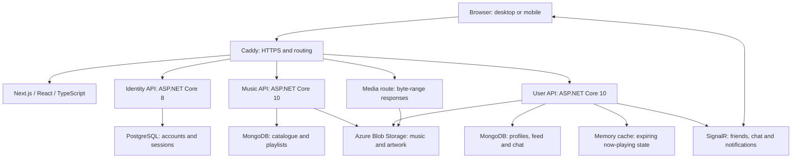

# Spotibuds project showcase

Spotibuds brings music listening and social interaction into one app. These recordings demonstrate complete workflows; the source and verification records explain their implementation.

## Watch

Start with the **[1:16 overview with sound](https://spotibuds.github.io/.github/#overview)**, then choose a workflow:

| Video                                                                           | Length | Workflows                                                                                                 |
| ------------------------------------------------------------------------------- | ------ | --------------------------------------------------------------------------------------------------------- |
| [Overview](https://spotibuds.github.io/.github/#overview)                       | 1:16   | Audible listening, reactions, collections and independent desktop/mobile chat                             |
| [Discover and listen](https://spotibuds.github.io/.github/#discover)            | 1:54   | Home, catalogue paging, music/people search, playback, queue, album/artist links and mobile navigation    |
| [Favorites and playlists](https://spotibuds.github.io/.github/#favorites)       | 0:57   | Favorites, creation, covers, visibility, album/song additions, order, persistence and disposable deletion |
| [Feed and listening profiles](https://spotibuds.github.io/.github/#feed)        | 1:42   | All five feed cards, navigation, playback, reactions, profiles, post links and listening history          |
| [Friends, chat and notifications](https://spotibuds.github.io/.github/#friends) | 1:24   | Request/cancel/decline/accept, profile messaging, delivery, receipts, saved chats and inbox actions       |
| [Accounts and administration](https://spotibuds.github.io/.github/#accounts)    | 1:46   | Registration, profile/avatar/privacy, sign-in/out, recovery limits and administration previews            |

[Captions, chapters, checksums and verification](https://github.com/Spotibuds/Frontend/releases/tag/demo-suite-2026-10-05) · [Coverage plan](../demo-coverage.md) · [Recorded feature index](../demo-coverage.json)

Watch directly in your browser with sound, captions and chapter navigation. No download or account is needed; the recordings are hosted independently of the app server.

The videos use actual browser interactions, live APIs and existing catalogue media. Music is audible where the app plays it, including pauses, mute and seeking. Actions remain at real speed; edits trim navigation/loading between scenes and briefly hold final states for caption reading. Paired desktop/mobile chat footage uses independent sessions. Mobile footage demonstrates web behavior at a 393 × 852 touch viewport.

The five focused recordings cover **52 scenes and 153 feature entries**. The index distinguishes working actions from administration previews. Catalogue creation/editing/deletion and role changes are not saved; production email recovery remains unavailable. Current synthetic history/inboxes do not contain enough records to demonstrate pagination. Native browser/OS notification prompts are outside the recording; live in-app inbox actions are shown. The original data was preserved; only demonstration-created disposable records were removed.

The animation is silent. The MP4 recordings contain captured playback audio and include downloadable captions and chapter files.

## Architecture

The deployed environment uses Docker on an Azure VM. This is a single-instance demo deployment. Now-playing state uses a bounded in-process cache. Redis is provisioned in the local environment but is not required for media delivery or configured as a SignalR backplane. The separate service repositories are [Identity](https://github.com/Spotibuds/Identity), [Music](https://github.com/Spotibuds/Music) and [User](https://github.com/Spotibuds/User).

## Engineering decisions

- **Session handling:** access tokens remain in memory; refresh credentials use HttpOnly cookies. A shared refresh coordinator and two-phase renewal handle expiry and interrupted navigation. Session changes stop playback and obsolete requests.
- **Reusable listening controls:** catalogue rows, feed cards and the expanded player use the same audio state. Album and performer links are separate controls, so navigation and playback have distinct behavior. Media byte ranges allow progressive playback and seeking.
- **Responsive loading:** profile and artist headers appear after their primary request; independent collections load separately. Direct profile links avoid an intermediate redirect. Route instances and abort/version guards prevent late responses from replacing a newly opened page.
- **Data integrity:** playlist membership and social operations use server authorization and transactional updates. Favorites converge across the library and player. Failed writes retain input with actionable feedback.
- **Realtime communication:** chat sends use a stable draft ID and persisted acknowledgement. Independent sessions demonstrate message delivery and history after reload. Backend commands own authorization and persistence for hub and REST entry points.
- **Responsive interaction:** desktop and mobile share components and data. The chat layout reserves the measured player height, keeping the mobile composer accessible while music plays.
- **Demo preparation:** small, journaled activity additions reuse existing catalogue IDs. Pre-write backups and preservation checks protect existing data; no reset was used for this recording.

## Verification and limits

The frontend readiness pass completed **234 tests across 27 files**, TypeScript checking, ESLint with zero warnings and a production build. The release passed **31 live deployment checks**. The selected recorded scenes completed without browser errors. These results are a scoped verification record, not an exhaustive accessibility, device, concurrency or load certification.

[Product readiness evidence](../product-readiness-verification.json) lists the reviewed areas, fixes and test methods. [Showcase verification](showcase-verification.json) records the deployed source revisions, recording method and final encoding checks. The [demo release](https://github.com/Spotibuds/Frontend/releases/tag/demo-suite-2026-10-05) includes captions and SHA-256 checksums.

Own-profile navigation samples decreased from about 1.94 seconds before the change to 0.45–0.94 seconds afterward. Those few samples include browser rendering and variable network activity; they are not a performance SLA. Artist timings remained variable, so the improvement claimed there is earlier primary content and independent section loading. The live playback check observed progress and a successful HTTP 206 response without media interception.

Remaining operational work includes configuring the production email relay for password recovery, upgrading Identity's .NET 8 runtime, and testing load and multiple replicas before scaling. Three artists retain initial-based artwork fallbacks where a verified picture was unavailable. The dependency audit exception and expiry are documented in the [frontend README](../../README.md#dependency-exception-and-evidence).

## Run locally

Follow the [isolated demo guide](../../demo/README.md) for the four sibling repositories, generated local credentials, Docker dependencies and verification commands. That reproducible setup uses generated tone fixtures and fresh local data. It does not depend on the production music files or cloud credentials.
